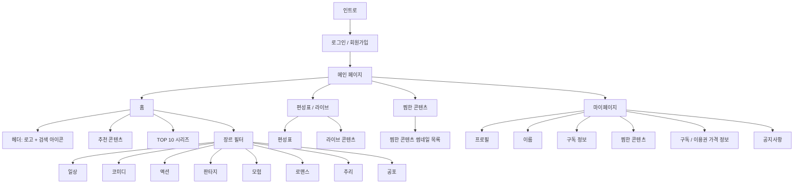

# CHAMVERSE

> 옛날 투니버스와 챔프의 감성을 현대적인 OTT 경험으로 재해석한 애니메이션 스트리밍 플랫폼

CHAMVERSE는 **CHAMP + TOONIVERSE**의 감성을 결합한 애니메이션 OTT 애플리케이션입니다.  
어린 시절 투니버스와 챔프를 즐겨본 이용자에게는 추억을, 어린이·청소년·성인 이용자에게는 다양한 애니메이션 콘텐츠를 제공하는 것을 목표로 합니다.

---

## 1. Project Overview

- **프로젝트명**: CHAMVERSE
- **프로젝트 유형**: 애니메이션 OTT 플랫폼
- **핵심 콘셉트**: 추억의 애니메이션 감성 + 현대적인 스트리밍 서비스
- **주요 키워드**: 애니메이션, OTT, 라이브, 편성표, 찜, 구독, 키즈, 레트로 감성

---

## 2. Target Audience

CHAMVERSE는 다음 이용자를 주요 타겟으로 합니다.

- 옛날 투니버스와 챔프의 감성을 다시 느끼고 싶은 이용자
- 애니메이션을 즐겨보는 어린이
- 다양한 장르의 콘텐츠를 찾는 청소년
- 추억의 작품과 최신 애니메이션을 함께 즐기고 싶은 성인

---

## 3. Brand Color

### Main Color

| Color | HEX | Usage |
|---|---|---|
| Coral Pink | `#F46E69` | 로고, 주요 버튼, 활성 메뉴, 강조 영역 |

### Sub Colors

| Color | HEX | Usage |
|---|---|---|
| Bright Blue | `#3C82FD` | 보조 버튼, 링크, 라이브 및 정보 요소 |
| Sunny Yellow | `#FDC327` | 배지, 포인트, 이벤트 및 강조 요소 |

### Color Ratio Guide

- Main Color `#F46E69`: 약 60%
- Blue `#3C82FD`: 약 20%
- Yellow `#FDC327`: 약 10%
- White / Neutral Color: 약 10%

> 메인 컬러를 중심으로 사용하고, 파랑과 노랑은 포인트 컬러로 제한하여 귀여우면서도 정돈된 인상을 유지합니다.

---

## 4. Typography

- **Main Font**: 페이퍼로지 Paperozi

---

## 5. User Flow



---

## 6. Navigation Structure

하단 고정 메뉴는 총 4개로 구성합니다.

### 1) 홈

- 상단 헤더
  - CHAMVERSE 로고
  - 검색 아이콘
- 추천 콘텐츠
- TOP 10 시리즈
- 장르별 콘텐츠 필터
  - 일상
  - 코미디
  - 액션
  - 판타지
  - 모험
  - 로맨스
  - 추리
  - 공포

### 2) 편성표 / 라이브

- 날짜 및 시간대별 편성표
- 현재 방송 중인 라이브 콘텐츠
- 다음 방송 콘텐츠 안내
- 라이브 재생 화면 이동

### 3) 찜한 콘텐츠

- 사용자가 찜한 콘텐츠 썸네일 목록
- 콘텐츠 상세 페이지 이동
- 찜 해제 기능
- 최근 추가한 순서 또는 장르별 정렬

### 4) 마이페이지

- 계정 정보
  - 프로필 이미지
  - 사용자 이름
  - 구독 정보
- 마이 메뉴
  - 찜한 콘텐츠
  - 구독 및 이용권 가격 정보
  - 공지사항

---

## 7. Design Concept

### Cute but Clean

CHAMVERSE의 디자인은 **귀엽지만 깔끔한 스타일**을 지향합니다.

#### Cute

- 메인 컬러와 서브 컬러를 활용한 밝고 생동감 있는 분위기
- 둥근 모서리와 부드러운 형태
- 캐릭터 프로필과 재미있는 배지 디자인
- 애니메이션 채널의 레트로 감성을 연상시키는 컬러 포인트

#### Clean

- 사용자가 쉽게 이해할 수 있는 단순한 화면 구조
- 명확한 메뉴 구분
- 넉넉한 여백
- 일관된 카드 및 버튼 디자인
- 콘텐츠 탐색에 집중할 수 있는 직관적인 레이아웃

---

## 8. Tech Stack

### Design

- Figma
- Adobe Illustrator

### Development

- Codex를 활용한 바이브 코딩
- HTML5
- CSS3
- JavaScript ES6+
- jQuery

### Data

- JSON

---

## 9. Main Features

### Authentication

- 로그인
- 회원가입
- 로그인 상태 유지
- 로그아웃

### Random Profile Thumbnail

- 로그인 또는 회원가입 완료 시 6가지 프로필 썸네일 중 1개를 랜덤 지급
- 마이페이지에서 현재 프로필 이미지 확인
- 추후 프로필 이미지 변경 기능 확장 가능

### Content Search

- 작품명 검색
- 검색 결과 썸네일 표시
- 검색 결과에서 재생 페이지로 이동

### Content Browsing

- 추천 콘텐츠
- TOP 10 콘텐츠
- 장르별 필터
- 콘텐츠 상세 정보
- 콘텐츠 재생

### Live & Schedule

- 날짜별 편성표
- 시간대별 프로그램 정보
- 현재 라이브 중인 콘텐츠 표시
- 라이브 콘텐츠 재생

### Wishlist

- 콘텐츠 찜하기
- 찜 해제
- 찜한 콘텐츠 목록 확인

### Subscription

- 현재 구독 상태 확인
- 이용권 종류 및 가격 정보 확인

### Notice

- 공지사항 목록
- 공지사항 상세 내용 확인

---

## 10. Page List

| Page | File | Description |
|---|---|---|
| Intro | `index.html` | 서비스 인트로 및 시작 화면 |
| Login | `login.html` | 로그인 |
| Sign Up | `signup.html` | 회원가입 |
| Main | `main.html` | 추천, TOP 10, 장르별 콘텐츠 |
| Search | `search.html` | 콘텐츠 검색 |
| Play | `play.html` | 콘텐츠 상세 및 재생 |
| Live | `live.html` | 편성표 및 라이브 콘텐츠 |
| Wishlist | `wish.html` | 찜한 콘텐츠 |
| My Page | `myPage.html` | 계정 및 구독 정보 |
| Price | `price.html` | 이용권 및 가격 정보 |
| Notice | `notice.html` | 공지사항 |

---

## 11. Project Structure

```text
CHAMVERSE-platform/
├── font/
│   ├── main-font/
│   └── sub-font/
│
├── html/
│   ├── common.html
│   ├── index.html
│   ├── login.html
│   ├── signup.html
│   ├── main.html
│   ├── search.html
│   ├── play.html
│   ├── live.html
│   ├── wish.html
│   ├── myPage.html
│   ├── price.html
│   └── notice.html
│
├── css/
│   ├── common.css
│   ├── index.css
│   ├── login.css
│   ├── signup.css
│   ├── main.css
│   ├── search.css
│   ├── play.css
│   ├── live.css
│   ├── wish.css
│   ├── myPage.css
│   ├── price.css
│   └── notice.css
│
├── js/
│   ├── common.js
│   ├── index.js
│   ├── login.js
│   ├── signup.js
│   ├── main.js
│   ├── search.js
│   ├── play.js
│   ├── live.js
│   ├── wish.js
│   ├── myPage.js
│   ├── price.js
│   └── notice.js
│
├── data/
│   ├── profile.json         # 랜덤 프로필 썸네일
│   ├── contents.json        # 콘텐츠 목록 및 카드 정보
│   ├── category.json        # 장르 목록
│   ├── users.json           # 회원 정보 샘플
│   ├── searchKeyword.json   # 인기 검색어 및 추천 검색어
│   └── play.json            # 콘텐츠 상세 및 회차 정보
│
├── images/
│   ├── common/
│   ├── index/
│   ├── login/
│   ├── signup/
│   ├── main/
│   ├── search/
│   ├── play/
│   ├── live/
│   ├── wish/
│   ├── myPage/
│   ├── price/
│   └── notice/
│
└── README.md
```

### Common Files

- `common.html`
  - 공통 헤더
  - 공통 하단 내비게이션
  - 공통 푸터

- `common.css`
  - 컬러 변수
  - 폰트
  - 초기화 스타일
  - 공통 버튼
  - 공통 카드
  - 헤더 및 하단 내비게이션

- `common.js`
  - 공통 메뉴 동작
  - 로그인 상태 확인
  - 공통 데이터 로드
  - 찜 상태 관리

---

## 12. Suggested CSS Variables

```css
:root {
  --color-primary: #F46E69;
  --color-secondary-blue: #3C82FD;
  --color-secondary-yellow: #FDC327;

  --color-background: #FFFFFF;
  --color-surface: #F8F8F8;
  --color-text-primary: #222222;
  --color-text-secondary: #666666;
  --color-border: #E8E8E8;

  --radius-small: 8px;
  --radius-medium: 16px;
  --radius-large: 24px;
}
```

---

## 13. Genre Categories

CHAMVERSE의 콘텐츠 장르는 다음 순서로 구성합니다.

1. 일상
2. 코미디
3. 액션
4. 판타지
5. 모험
6. 로맨스
7. 추리
8. 공포

각 콘텐츠는 대표 장르 1개와 여러 개의 보조 장르를 가질 수 있습니다.

```json
{
  "id": 1,
  "title": "콘텐츠 제목",
  "thumbnail": "../images/main/sample.jpg",
  "mainGenre": "판타지",
  "subGenres": ["액션", "모험"],
  "isTop10": true,
  "isRecommended": true
}
```

---

## 14. Development Plan

### Phase 1. Design

- 와이어프레임 제작
- 디자인 시스템 정의
- 메인 화면 및 주요 페이지 디자인
- 반응형 레이아웃 기준 설정

### Phase 2. Markup

- 공통 레이아웃 제작
- 페이지별 HTML 구조 작성
- CSS 스타일 적용
- 모바일 중심 반응형 구현

### Phase 3. Interaction

- 로그인 및 회원가입
- 랜덤 프로필 지급
- 콘텐츠 검색
- 장르 필터
- 찜 기능
- 라이브 및 편성표 구현

### Phase 4. Data Integration

- `play.json` 콘텐츠 데이터 연결
- `channel.json` 편성표 데이터 연결
- LocalStorage를 활용한 로그인 및 찜 상태 관리

### Phase 5. QA

- 화면별 기능 테스트
- 반응형 테스트
- 브라우저 호환성 확인
- 접근성과 사용성 개선

---

## 15. Future Improvements

- 실제 스트리밍 API 연동
- 프로필 이미지 선택 및 변경
- 다중 프로필 지원
- 키즈 모드
- 이어보기
- 시청 기록
- 사용자 맞춤 추천
- 알림 기능
- 댓글 및 리뷰
- 다크 모드
- 결제 시스템 연동

---

## 16. Naming

**CHAMVERSE**는 `CHAMP`와 `TOONIVERSE`의 감성을 결합한 이름입니다.

- **CHAM**: 챔프에서 가져온 친숙한 인상
- **VERSE**: 다양한 애니메이션 세계와 콘텐츠가 모이는 공간

CHAMVERSE는 세대와 취향을 넘어 누구나 자신만의 애니메이션 세계를 발견할 수 있는 플랫폼을 지향합니다.
