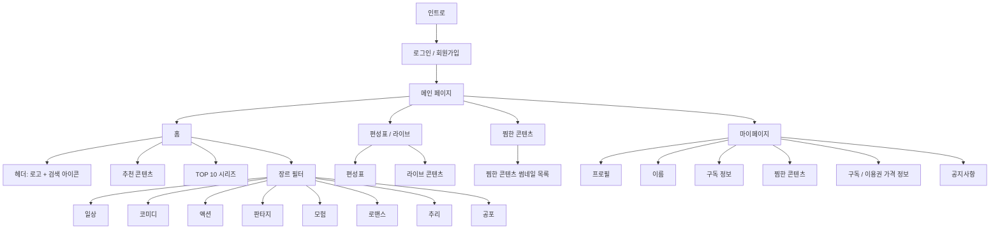
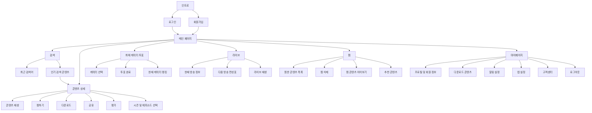

# CHAMVERSE

> 옛날 투니버스와 챔프의 감성을 현대적인 OTT 경험으로 재해석한 애니메이션 스트리밍 플랫폼

CHAMVERSE는 **CHAMP + TOONIVERSE**의 감성을 결합한 애니메이션 OTT 애플리케이션입니다.  
어린 시절 투니버스와 챔프를 즐겨본 이용자에게는 추억을, 어린이·청소년·성인 이용자에게는 다양한 애니메이션 콘텐츠를 제공하는 것을 목표로 합니다.

---

## 1. Project Overview

- **프로젝트명**: CHAMVERSE
- **프로젝트 유형**: 애니메이션 OTT 플랫폼
- **핵심 콘셉트**: 추억의 애니메이션 감성 + 현대적인 스트리밍 서비스
- **주요 키워드**: 애니메이션, OTT, 라이브, 편성표, 찜, 구독, 키즈, 레트로 감성

---

## 2. Target Audience

CHAMVERSE는 다음 이용자를 주요 타겟으로 합니다.

- 옛날 투니버스와 챔프의 감성을 다시 느끼고 싶은 이용자
- 애니메이션을 즐겨보는 어린이
- 다양한 장르의 콘텐츠를 찾는 청소년
- 추억의 작품과 최신 애니메이션을 함께 즐기고 싶은 성인

---

## 3. Brand Color

### Main Color

| Color | HEX | Usage |
|---|---|---|
| Coral Pink | `#F46E69` | 로고, 주요 버튼, 활성 메뉴, 강조 영역 |

### Sub Colors

| Color | HEX | Usage |
|---|---|---|
| Bright Blue | `#3C82FD` | 보조 버튼, 링크, 라이브 및 정보 요소 |
| Sunny Yellow | `#FDC327` | 배지, 포인트, 이벤트 및 강조 요소 |

### Color Ratio Guide

- Main Color `#F46E69`: 약 60%
- Blue `#3C82FD`: 약 20%
- Yellow `#FDC327`: 약 10%
- White / Neutral Color: 약 10%

> 메인 컬러를 중심으로 사용하고, 파랑과 노랑은 포인트 컬러로 제한하여 귀여우면서도 정돈된 인상을 유지합니다.

---

## 4. Typography

- **Main Font**: 페이퍼로지 Paperozi

---

## 5. User Flow



### Extended User Flow



---

## 6. Navigation Structure

하단 고정 메뉴는 총 4개로 구성합니다.

### 1) 홈

- 상단 헤더
  - CHAMVERSE 로고
  - 검색 아이콘
- 추천 콘텐츠
- TOP 10 시리즈
- 장르별 콘텐츠 필터
  - 일상
  - 코미디
  - 액션
  - 판타지
  - 모험
  - 로맨스
  - 추리
  - 공포

### 2) 편성표 / 라이브

- 날짜 및 시간대별 편성표
- 현재 방송 중인 라이브 콘텐츠
- 다음 방송 콘텐츠 안내
- 라이브 재생 화면 이동

### 3) 찜한 콘텐츠

- 사용자가 찜한 콘텐츠 썸네일 목록
- 콘텐츠 상세 페이지 이동
- 찜 해제 기능
- 최근 추가한 순서 또는 장르별 정렬

### 4) 마이페이지

- 계정 정보
  - 프로필 이미지
  - 사용자 이름
  - 구독 정보
- 마이 메뉴
  - 찜한 콘텐츠
  - 구독 및 이용권 가격 정보
  - 공지사항

### 6-1. Wireframe Screen Structure

CHAMVERSE의 와이어프레임은 모바일 애플리케이션을 기준으로 설계하였으며, 주요 화면에서 동일한 하단 내비게이션을 유지합니다.

#### Common Bottom Navigation

| Menu | Description |
|---|---|
| 홈 | 추천 콘텐츠, TOP 10, 장르별 콘텐츠 탐색 |
| 라이브 | 실시간 방송과 시간대별 편성표 확인 |
| 찜 | 사용자가 저장한 콘텐츠 확인 |
| 마이페이지 | 계정, 다운로드, 알림 및 설정 관리 |

현재 선택된 메뉴는 메인 컬러인 Coral Pink로 강조하여 사용자가 현재 위치를 쉽게 확인할 수 있도록 합니다.

#### Common Header

화면의 목적에 따라 다음과 같은 헤더 유형을 사용합니다.

- 로고형 헤더
  - CHAMVERSE 로고
  - 검색 아이콘
  - 프로필 아이콘
- 타이틀형 헤더
  - 뒤로 가기 버튼
  - 페이지 제목
  - 편집 또는 부가 기능 버튼
- 브랜드형 헤더
  - 콘텐츠 및 이벤트 페이지에서 CHAMVERSE 브랜드명을 중앙에 배치

---

## 7. Design Concept

### Cute but Clean

CHAMVERSE의 디자인은 **귀엽지만 깔끔한 스타일**을 지향합니다.

#### Cute

- 메인 컬러와 서브 컬러를 활용한 밝고 생동감 있는 분위기
- 둥근 모서리와 부드러운 형태
- 캐릭터 프로필과 재미있는 배지 디자인
- 애니메이션 채널의 레트로 감성을 연상시키는 컬러 포인트

#### Clean

- 사용자가 쉽게 이해할 수 있는 단순한 화면 구조
- 명확한 메뉴 구분
- 넉넉한 여백
- 일관된 카드 및 버튼 디자인
- 콘텐츠 탐색에 집중할 수 있는 직관적인 레이아웃

### 7-1. Mobile Layout Guide

와이어프레임은 모바일 세로형 레이아웃을 기준으로 제작합니다.

- 콘텐츠 영역은 세로 스크롤 방식으로 구성
- 하단 내비게이션은 화면 아래에 고정
- 가로 콘텐츠 목록은 수평 스크롤 방식 적용
- 카드와 버튼은 둥근 모서리를 사용하여 부드러운 인상 제공
- 주요 CTA 버튼은 화면 너비에 가깝게 배치하여 터치 접근성 강화
- 목록형 설정 화면은 동일한 높이와 구분선을 사용하여 일관성 유지
- 콘텐츠 썸네일은 페이지 목적에 따라 가로형과 세로형 비율을 구분하여 사용

#### Layout Components

- `App Header`
- `Bottom Navigation`
- `Content Carousel`
- `Horizontal Content List`
- `Poster Grid`
- `Episode List`
- `Setting List`
- `Toggle Switch`
- `Progress Bar`
- `Toast Message`
- `Tab Menu`
- `Filter Chip`
- `Primary CTA Button`

---

## 8. Tech Stack

### Design

- Figma
- Adobe Illustrator

### Development

- Codex를 활용한 바이브 코딩
- HTML5
- CSS3
- JavaScript ES6+
- jQuery

### Data

- JSON

---

## 9. Main Features

### Authentication

- 로그인
- 회원가입
- 로그인 상태 유지
- 로그아웃

### Random Profile Thumbnail

- 로그인 또는 회원가입 완료 시 6가지 프로필 썸네일 중 1개를 랜덤 지급
- 마이페이지에서 현재 프로필 이미지 확인
- 추후 프로필 이미지 변경 기능 확장 가능

### Content Search

- 작품명 검색
- 검색 결과 썸네일 표시
- 검색 결과에서 재생 페이지로 이동

### Recent Search History

- 사용자가 검색한 최근 검색어 저장
- 최근 검색어 개별 삭제
- 작품명과 캐릭터명 통합 검색
- 인기 검색 콘텐츠를 가로형 목록으로 제공
- 검색 결과 선택 시 콘텐츠 상세 페이지로 이동

### Content Browsing

- 추천 콘텐츠
- TOP 10 콘텐츠
- 장르별 필터
- 콘텐츠 상세 정보
- 콘텐츠 재생

### Continue Watching

- 최근 시청한 콘텐츠 목록 제공
- 콘텐츠별 시청 진행률 표시
- 마지막으로 시청한 에피소드 정보 표시
- 선택 시 마지막 재생 위치부터 이어보기

### Content Detail

- 콘텐츠 대표 이미지 및 배경 이미지 제공
- 콘텐츠 제목, 시즌, 연령 등급, 장르, 제작 연도 표시
- 콘텐츠 줄거리 제공
- 재생, 찜, 다운로드, 공유 및 평가 기능 제공
- 시즌 선택 드롭다운 제공
- 에피소드별 썸네일과 제목, 설명, 방영일 및 러닝타임 표시

### Live & Schedule

- 날짜별 편성표
- 시간대별 프로그램 정보
- 현재 라이브 중인 콘텐츠 표시
- 라이브 콘텐츠 재생

### Wishlist

- 콘텐츠 찜하기
- 찜 해제
- 찜한 콘텐츠 목록 확인

### Subscription

- 현재 구독 상태 확인
- 이용권 종류 및 가격 정보 확인

### Notice

- 공지사항 목록
- 공지사항 상세 내용 확인

### Download Management

- 다운로드 콘텐츠 목록 확인
- 전체, 시리즈, 극장판 탭 제공
- 최신 다운로드순 등 정렬 기능 제공
- 다운로드 콘텐츠 재생
- 콘텐츠별 용량과 다운로드 완료 날짜 표시
- 다운로드 콘텐츠 개별 메뉴 제공
- 오프라인 저장 공간 사용량 표시
- 저장 공간 진행률 표시

### Notification Settings

- 전체 알림 설정
- 신작 및 업데이트 알림
- 극장판 공개 알림
- 라이브 시작 알림
- 이벤트 및 혜택 알림
- 맞춤 콘텐츠 추천
- 인기 콘텐츠 추천
- 시청 이어보기 알림
- 알림 수신 시간 설정

### Application Settings

- 다음 화 자동 재생 설정
- 화질 설정
- 엔딩 크레딧 건너뛰기 설정
- 데이터 절약 모드 설정
- 다크 모드 설정
- 언어 설정
- 자주 묻는 질문
- 1:1 문의
- 이용 약관
- 개인정보처리방침
- 앱 버전 정보 확인
- 로그아웃 및 회원 탈퇴

### Character Voting

- 사용자가 선호하는 캐릭터를 선택하여 투표
- 투표 기간과 종료일까지 남은 기간 표시
- 캐릭터 카드 그리드 제공
- 선택된 캐릭터 카드 강조
- 투표 완료 기능
- 현재 캐릭터 랭킹 확인
- 1위부터 3위까지 포디움 형태로 표시
- 4위부터 10위까지 순위와 득표율 표시
- 이벤트 메인 배너에서 투표 및 랭킹 페이지로 이동

### Empty State

찜한 콘텐츠가 없는 경우 빈 화면만 표시하지 않고 다음 정보를 제공합니다.

- 빈 상태를 표현하는 캐릭터 이미지
- 아직 찜한 작품이 없다는 안내 문구
- 콘텐츠 둘러보기 버튼
- 사용자가 관심을 가질 만한 추천 작품 목록

### Feedback Message

- 찜 삭제와 같은 사용자 작업 완료 시 토스트 메시지 표시
- 실행 취소 기능 제공
- 화면 이동 없이 작업 결과를 즉시 확인할 수 있도록 구성

---

## 10. Page List

| Page | File | Description |
|---|---|---|
| Intro | `index.html` | 서비스 인트로 및 시작 화면 |
| Login | `login.html` | 로그인 |
| Sign Up | `signup.html` | 회원가입 |
| Main | `main.html` | 추천, TOP 10, 장르별 콘텐츠 |
| Search | `search.html` | 콘텐츠 검색 |
| Play | `play.html` | 콘텐츠 상세 및 재생 |
| Live | `live.html` | 편성표 및 라이브 콘텐츠 |
| Wishlist | `wish.html` | 찜한 콘텐츠 |
| My Page | `myPage.html` | 계정 및 구독 정보 |
| Price | `price.html` | 이용권 및 가격 정보 |
| Notice | `notice.html` | 공지사항 |
| Download | `download.html` | 다운로드 콘텐츠와 오프라인 저장 공간 관리 |
| Settings | `settings.html` | 재생 설정, 앱 환경 설정 및 고객 지원 |
| Notification Settings | `notification.html` | 서비스 및 콘텐츠 추천 알림 관리 |
| Character Vote Event | `voteEvent.html` | 캐릭터 투표 이벤트 메인 화면 |
| Character Vote | `vote.html` | 캐릭터 선택 및 투표 |
| Character Ranking | `ranking.html` | 실시간 캐릭터 투표 순위 |

### Wireframe Page Details

#### Intro / Login

- CHAMVERSE 로고를 중심으로 브랜드 인상 전달
- 이메일 또는 휴대폰 번호 입력
- 비밀번호 입력 및 비밀번호 표시 설정
- 로그인 CTA 버튼
- 회원가입 및 간편 로그인 연결
- 안전한 시청 환경 안내

#### Sign Up

- CHAMVERSE 로고와 서비스 가입 안내
- 기본 회원가입 버튼
- 카카오, 네이버, 구글 소셜 회원가입
- 기존 계정 보유자를 위한 로그인 연결

#### Main

- 로고, 검색, 프로필로 구성된 상단 헤더
- 이번 주 추천 콘텐츠 배너
- 콘텐츠 재생 및 찜 버튼
- TOP 10 시리즈
- 이어보기 콘텐츠
- 캐릭터 투표 이벤트 배너
- 장르별 콘텐츠
- 신규 에피소드 배너
- 극장판 콘텐츠
- 공지사항
- 서비스 안내 푸터

#### Search

- 작품명과 캐릭터명 검색
- 최근 검색어 목록
- 최근 검색어 개별 삭제
- 현재 인기 콘텐츠 목록

#### Live

- 현재 방송 중인 콘텐츠 대표 영역
- 라이브 배지
- 현재 방송 제목과 에피소드 정보
- 방송 진행률 및 시작·종료 시간
- 현재 방송과 다음 방송 편성표
- 방송 알림 설정

#### Wishlist

- 이어보기 콘텐츠 강조 카드
- 전체, 시리즈, 극장판 탭
- 최신 찜순 정렬
- 세로형 포스터 그리드
- 찜 콘텐츠 편집 및 삭제
- 삭제 완료 토스트 및 실행 취소
- 빈 목록 안내와 추천 콘텐츠 제공

#### My Page

- 프로필 이미지
- 사용자 이름, 회원 등급 및 이메일
- 로그아웃
- 계속 시청하기 콘텐츠
- 찜한 콘텐츠 수
- 다운로드 콘텐츠 수
- 알림 설정
- 앱 설정
- 고객센터

#### Download

- 오프라인 저장 공간 사용량
- 전체 용량 대비 사용량 표시
- 전체, 시리즈, 극장판 필터
- 정렬 드롭다운
- 콘텐츠 썸네일, 제목, 회차 정보
- 파일 용량과 다운로드 완료일
- 다운로드 콘텐츠 재생 및 추가 메뉴

#### Settings

- 재생 설정
- 앱 환경 설정
- 고객 지원
- 앱 버전
- 로그아웃
- 회원 탈퇴

#### Notification Settings

- 전체 알림
- 서비스 알림
- 콘텐츠 추천 알림
- 알림 수신 시간 설정

#### Content Detail

- 콘텐츠 배경 이미지
- 콘텐츠 정보와 줄거리
- 재생 및 찜 버튼
- 다운로드, 공유, 평가 기능
- 시즌 선택
- 에피소드 목록

#### Character Vote Event

- 캐릭터 패턴을 활용한 이벤트 배경
- 이벤트 종료일까지 남은 기간
- 투표 참여 인원
- 투표 페이지 이동
- 캐릭터 랭킹 페이지 이동

#### Character Vote

- 투표 기간
- 대표 캐릭터 이미지
- 캐릭터 선택 카드
- 선택 상태 강조
- 투표 완료 버튼

#### Character Ranking

- 1위, 2위, 3위 캐릭터 포디움
- 4위부터 10위까지 순위 목록
- 캐릭터별 득표율 프로그레스 바

---

## 11. Project Structure

```text
CHAMVERSE-platform/
├── font/
│   ├── main-font/
│   └── sub-font/
│
├── html/
│   ├── common.html
│   ├── index.html
│   ├── login.html
│   ├── signup.html
│   ├── main.html
│   ├── search.html
│   ├── play.html
│   ├── live.html
│   ├── wish.html
│   ├── myPage.html
│   ├── price.html
│   ├── notice.html
│   ├── download.html
│   ├── settings.html
│   ├── notification.html
│   ├── voteEvent.html
│   ├── vote.html
│   └── ranking.html
│
├── css/
│   ├── common.css
│   ├── index.css
│   ├── login.css
│   ├── signup.css
│   ├── main.css
│   ├── search.css
│   ├── play.css
│   ├── live.css
│   ├── wish.css
│   ├── myPage.css
│   ├── price.css
│   ├── notice.css
│   ├── download.css
│   ├── settings.css
│   ├── notification.css
│   ├── voteEvent.css
│   ├── vote.css
│   └── ranking.css
│
├── js/
│   ├── common.js
│   ├── index.js
│   ├── login.js
│   ├── signup.js
│   ├── main.js
│   ├── search.js
│   ├── play.js
│   ├── live.js
│   ├── wish.js
│   ├── myPage.js
│   ├── price.js
│   ├── notice.js
│   ├── download.js
│   ├── settings.js
│   ├── notification.js
│   ├── voteEvent.js
│   ├── vote.js
│   └── ranking.js
│
├── data/
│   ├── profile.json         # 랜덤 프로필 썸네일
│   ├── contents.json        # 콘텐츠 목록 및 카드 정보
│   ├── category.json        # 장르 목록
│   ├── users.json           # 회원 정보 샘플
│   ├── searchKeyword.json   # 인기 검색어 및 추천 검색어
│   ├── play.json            # 콘텐츠 상세 및 회차 정보
│   ├── channel.json         # 라이브 채널 및 편성표 정보
│   ├── downloads.json       # 다운로드 콘텐츠 및 저장 공간 정보
│   ├── notifications.json   # 알림 종류와 사용자 설정값
│   ├── settings.json        # 재생 및 앱 환경 설정값
│   ├── vote.json            # 캐릭터 투표 후보 및 투표 정보
│   └── ranking.json         # 캐릭터 순위와 득표율 정보
│
├── images/
│   ├── common/
│   ├── contents/
│   ├── profile/
│   ├── index/
│   ├── login/
│   ├── signup/
│   ├── main/
│   ├── search/
│   ├── play/
│   ├── live/
│   ├── wish/
│   ├── myPage/
│   ├── price/
│   ├── notice/
│   ├── download/
│   ├── settings/
│   ├── notification/
│   ├── voteEvent/
│   ├── vote/
│   └── ranking/
│
└── README.md
```

### Common Files

- `common.html`
  - 공통 헤더
  - 공통 하단 내비게이션
  - 공통 푸터

- `common.css`
  - 컬러 변수
  - 폰트
  - 초기화 스타일
  - 공통 버튼
  - 공통 카드
  - 헤더 및 하단 내비게이션

- `common.js`
  - 공통 메뉴 동작
  - 로그인 상태 확인
  - 공통 데이터 로드
  - 찜 상태 관리

---

## 12. Suggested CSS Variables

```css
:root {
  --color-primary: #F46E69;
  --color-primary-dark: #EE5D59;
  --color-primary-light: #FFF1EC;

  --color-secondary-blue: #3C82FD;
  --color-secondary-yellow: #FDC327;

  --color-background: #FFFFFF;
  --color-background-warm: #FFF9F4;
  --color-surface: #F8F8F8;
  --color-surface-secondary: #F1F1F1;

  --color-text-primary: #222222;
  --color-text-secondary: #666666;
  --color-border: #E8E8E8;
  --color-disabled: #B8B8B8;
  --color-progress-background: #D9D9D9;
  --color-toast: #3D3D3D;

  --header-height: 64px;
  --bottom-nav-height: 64px;
  --content-padding: 20px;

  --radius-small: 8px;
  --radius-medium: 16px;
  --radius-large: 24px;
  --radius-card: 12px;
  --radius-button: 10px;
  --radius-pill: 999px;

  --shadow-card: 0 4px 16px rgba(0, 0, 0, 0.06);
}
```

---

## 13. Genre Categories

CHAMVERSE의 콘텐츠 장르는 다음 순서로 구성합니다.

1. 일상
2. 코미디
3. 액션
4. 판타지
5. 모험
6. 로맨스
7. 추리
8. 공포

각 콘텐츠는 대표 장르 1개와 여러 개의 보조 장르를 가질 수 있습니다.

```json
{
  "id": 1,
  "title": "콘텐츠 제목",
  "thumbnail": "../images/main/sample.jpg",
  "mainGenre": "판타지",
  "subGenres": ["액션", "모험"],
  "isTop10": true,
  "isRecommended": true
}
```

### 13-1. Content Card Types

CHAMVERSE에서는 콘텐츠의 위치와 목적에 따라 카드 형태를 구분합니다.

#### Landscape Card

- 추천 콘텐츠
- 이어보기
- 라이브
- 다운로드 콘텐츠
- 에피소드 목록

#### Portrait Card

- TOP 10 콘텐츠
- 장르별 콘텐츠
- 찜한 콘텐츠
- 추천 작품
- 극장판 콘텐츠

#### Ranking Card

- 캐릭터 순위
- 캐릭터 이미지
- 순위 번호
- 캐릭터명
- 득표율
- 프로그레스 바

#### Character Vote Card

- 캐릭터 이미지
- 캐릭터명
- 선택 상태
- 선택 시 메인 컬러 테두리 적용

---

## 14. Development Plan

### Phase 1. Design

- 와이어프레임 제작
- 디자인 시스템 정의
- 메인 화면 및 주요 페이지 디자인
- 반응형 레이아웃 기준 설정

### Phase 2. Markup

- 공통 레이아웃 제작
- 페이지별 HTML 구조 작성
- CSS 스타일 적용
- 모바일 중심 반응형 구현

### Phase 3. Interaction

- 로그인 및 회원가입
- 랜덤 프로필 지급
- 콘텐츠 검색
- 장르 필터
- 찜 기능
- 라이브 및 편성표 구현
- 최근 검색어 저장 및 삭제
- 이어보기 진행률 관리
- 콘텐츠 다운로드 상태 관리
- 다운로드 저장 공간 계산
- 설정 토글 상태 저장
- 알림 항목별 활성화 및 비활성화
- 캐릭터 선택 및 투표
- 캐릭터 실시간 순위 표시
- 찜 삭제 토스트 및 실행 취소

### Phase 4. Data Integration

- `play.json` 콘텐츠 데이터 연결
- `channel.json` 편성표 데이터 연결
- `downloads.json` 다운로드 콘텐츠 연결
- `notifications.json` 알림 설정 연결
- `settings.json` 사용자 환경 설정 연결
- `vote.json` 캐릭터 투표 후보 연결
- `ranking.json` 캐릭터 순위 연결
- LocalStorage를 활용한 로그인 및 찜 상태 관리
- LocalStorage를 활용한 최근 검색어 저장
- LocalStorage를 활용한 이어보기 진행률 저장
- LocalStorage를 활용한 다운로드 및 설정 상태 관리

### Phase 5. QA

- 화면별 기능 테스트
- 반응형 테스트
- 브라우저 호환성 확인
- 접근성과 사용성 개선

---

## 15. Future Improvements

- 실제 스트리밍 API 연동
- 프로필 이미지 선택 및 변경
- 다중 프로필 지원
- 키즈 모드
- 이어보기
- 시청 기록
- 사용자 맞춤 추천
- 알림 기능
- 댓글 및 리뷰
- 다크 모드
- 결제 시스템 연동
- 실제 콘텐츠 다운로드 및 오프라인 재생
- 기기별 다운로드 콘텐츠 동기화
- 실시간 캐릭터 투표 서버 연동
- 캐릭터 투표 중복 참여 방지
- 푸시 알림 서비스 연동
- 사용자별 알림 수신 시간 최적화
- 화질별 데이터 사용량 안내
- 자막 및 더빙 언어 선택
- 재생 속도 조절
- Picture-in-Picture 재생

---

## 16. Naming

**CHAMVERSE**는 `CHAMP`와 `TOONIVERSE`의 감성을 결합한 이름입니다.

- **CHAM**: 챔프에서 가져온 친숙한 인상
- **VERSE**: 다양한 애니메이션 세계와 콘텐츠가 모이는 공간

CHAMVERSE는 세대와 취향을 넘어 누구나 자신만의 애니메이션 세계를 발견할 수 있는 플랫폼을 지향합니다.

---

## 17. Wireframe Summary

CHAMVERSE의 와이어프레임은 콘텐츠 탐색부터 시청, 저장, 투표 및 사용자 설정까지 이어지는 모바일 OTT 서비스의 전체 흐름을 구성합니다.

### Core Experience

1. 사용자는 로그인 또는 회원가입 후 메인 페이지에 진입합니다.
2. 추천 콘텐츠, TOP 10, 이어보기 및 장르별 콘텐츠를 탐색합니다.
3. 검색 기능을 통해 작품명이나 캐릭터명으로 콘텐츠를 찾습니다.
4. 콘텐츠 상세 페이지에서 작품 정보와 에피소드를 확인합니다.
5. 콘텐츠를 재생하거나 찜하고, 오프라인 시청을 위해 다운로드합니다.
6. 라이브 메뉴에서 현재 방송과 다음 편성 정보를 확인합니다.
7. 마이페이지에서 시청 콘텐츠, 찜, 다운로드 및 계정 설정을 관리합니다.
8. 캐릭터 투표 이벤트에 참여하고 실시간 랭킹을 확인합니다.

### UX Direction

- 주요 기능을 하단 내비게이션 4개 메뉴 안에 배치
- 콘텐츠 탐색 과정에서 페이지 이동 단계를 최소화
- 진행률, 활성 탭, 선택 상태를 메인 컬러로 명확하게 표현
- 빈 목록, 작업 완료, 삭제 등의 상태에 즉각적인 피드백 제공
- 콘텐츠 카드와 목록의 디자인 규칙을 통일
- 어린이부터 성인까지 쉽게 사용할 수 있는 직관적인 인터페이스 구성